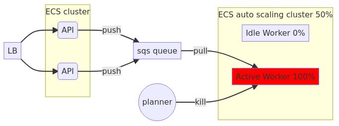

# Introduction

In this article I am going to explain a simple example of auto-scalable and cost-efficient architecture on AWS for a typical data analytics application. The use case can be described as:

| --- |
| An application has REST API to post data, launch analysis jobs on this data, and get the result. Analysis job consumes a lot of memory and CPU resources and can take up to 30 minutes to finish. Clients launch analysis jobs unpredictably and can launch multiple jobs at once causing load spikes. We need to design an auto-scalable and cost efficient architecture of such application. |

## First approach: Monolyth straitforward solution

We can simply build a monolyth application and lauch it in ECS auto-scaling group. Auto-scaling group will scale up or down our application depending on resource usage. 

However such approach has several disadvantages

### 1. Uneven instance load

We can get unlucky and majority of the jobs end up on one instance. Since processing jobs need unproportionally larger amount of resources compared to processing REST requests, instance performance will degrade heavily. Even though one instance is running on the edge, consuming 100% of resources, from the cluster perspective only 50% of resources are consumed, so scale-up does not happen (in case we configured to scale up only when >75% of the resources are used). This can result in slow response times for requests that hit the loaded instance and eventually the cluster can kill the instance if it stops responding. This will result in job loss.

### 2. Slowdown on jobs spike

Even if jobs are distributed evenly, we can fill all instances' capacity quickly during job spike. This will result in slow response times while auto-scaling group brings alive new instances (which can take minutes). If we get unlucky the cluster kills some instances which results in job loss like in the previous example.

### 3. Job loss on random instance failure

Even if jobs are distributed evenly and we don’t get heavy job spikes, we can still loose submitted jobs. AWS explicitly says that ECS instances might die time to time and guarantees [99.99% uptime](https://aws.amazon.com/compute/sla/) (~1 hour downtime per year), which means we can loose unfinished jobs sometimes. 

## Second approach: split into 2 services

This architecture is much better, since we can scale workers independently and they will not slow down our API. We now use a job queue so jobs will never be lost even if worker dies for some reason. And yet there is still a problem.

### 1. Job termination during scale-in

When we have a job spike, auto-scaling group increases the amount of workers. Once the job-queue is empty some workers will become idle. So auto-scaling group will start scaling-in, since we don't need that many workers any longer. Current options for [instance scale-in protection](https://docs.aws.amazon.com/autoscaling/ec2/userguide/ec2-auto-scaling-instance-protection.html#instance-protection-instance) is not trivial and does not guarantee that a working task is never terminated. So it might send a kill signal to an instance that runs an unfinished job. One solution would be to use lambda instead, but AWS lambda can run max 15 minutes, which is a showstopper for us. Some of our heavy jobs will never be processed if we use lambda.

## Final solution: split into 2 services and orchestrator

If AWS does not provide us with a proper scale-in protection, then we write our own orchestrator that will scale-up worker instances if the queue grows, but it will never scale them in. Instead, worker will simply terminate itself if there are no messages to consume from the job queue. This is a simple solution that guarantees no unnecessary job terminations (unless instance dies unexpectedly) and no idle workers.

# Implementation

You can find implementation of the described architection in [this github repository](https://github.com/pavradev/data-analytics-app-architecture-aws)